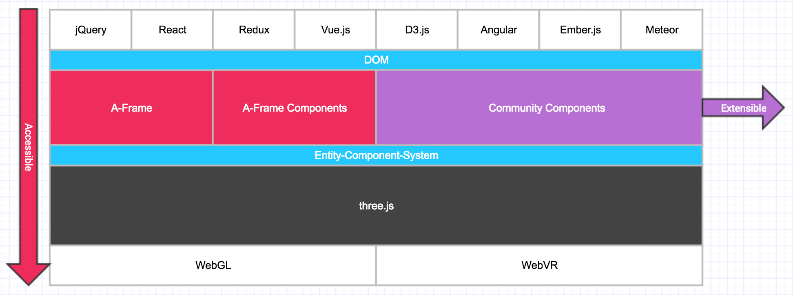

<!-- .slide: data-background="media/img/aframe.jpg" -->

<div class="talk-title">
  <h1>A-Frame</h1>
  <p>A web framework for building VR experiences</p>
  <p class="talk-info">
    @dmarcos | @andgokevin | Mozilla VR | **aframe.io**
  </p>
</div>

<!-- NOTES -->
- Onboard web developers into the 3D and VR world with easy-to-use tools
- Prototype WebVR experiences faster

------

<!-- .slide: data-background="media/img/venn-diagram.gif" -->

------

<!-- .slide: data-background="media/img/aframe.jpg" -->

## A-Frame School

An interactive WebVR course

[`aframe.io/school`](https://aframe.io/aframe-school/)  <!-- .element: class="cta-button" -->

------

# Powerful and Extensible

<!-- .slide: data-background="media/img/aframe.jpg" -->



------

# aframe-react


------


```js
import 'aframe';
import 'aframe-animation-component';
import 'aframe-particle-system-component';
import 'aframe-text-geometry-component';
import {Entity, Scene} from 'aframe-react';
import React from 'react';
import ReactDOM from 'react-dom';

import Sky from './components/Sky';
import Text from './components/Text';

class Scene extends React.Component {
  render () {
    return (
      <Scene>
        <Entity id="box"
          geometry={primitive: 'box'}
          material={{color: 'red', opacity: 0.6}}
          animation__rotate={{property: 'rotation', dur: 2000, loop: true, to: '360 360 360'}}
          animation__scale={{property: 'scale', dir: 'alternate', dur: 100, loop: true, to: '1.1 1.1 1.1'}}
          position='0 -0.5 -3'/>

        <Sky src="https://rawgit.com/aframevr/assets/gh-pages/360-image-gallery-boilerplate/img/sechelt.jpg"/>
        <Text text='Hello World!' color='#DADADA' position='-1.75 1 -3'/>

        <Entity particle-system={preset: 'snow', particleCount: 5000}/>

        <Entity light={{type: 'ambient', color: '#888'}}/>
        <Entity light={{type: 'directional', intensity: 1}} position='1 1 0'/>
      </Scene>
    );
  }
}

ReactDOM.render(<Scene/>, document.querySelector('.scene-container'));
```

------

# Entity-Component-System

<!-- .slide: data-background="media/img/minecraft-blocks.png" -->

<!-- NOTES -->
- Is an entity-component framework
- Popular in game development, used by Unity
- All objects in scene are **entities** that inherently empty objects. Plug in
  **components** to attach appearance / behavior / functionality
- 2D web where every element was fixed
- 3D/VR is different, objects of infinite types and complexities, need an easy way to build up different kinds of objects

------

<!-- .slide: data-background="media/img/standard-components.png" data-background-size="contain" -->

<!-- NOTES -->
- These are some components that ship with A-Frame
- A-Frame is fully extensible at its core so...

------

<!-- .slide: data-background="media/img/community-components.png" data-background-size="contain" -->

<!-- NOTES -->
- Community has filled the ecosystem with tons of components
- Components can do whatever they want, have full access to three.js and Web APIs
- The component ecosystem the lifeblood of A-Frame
- Physics, leap motion, particle systems, audio visualizations, oceans
- Drop these components as script tags and use them straight from HTML
- Advanced developers empowering other developers
- Working on collecting these components...

------

# Registry

<!-- .slide: data-background="media/img/minecraft-blocks.png" -->

Curated collection of A-Frame components

<a class="stretch" href="https://aframe.io/aframe-registry">
  <video loop data-src="media/video/registrypreview.mp4" data-autoplay></video>
</a>

<!-- NOTES -->
- Collecting them into the A-Frame registry
- Like a store of components that we make sure work well
- People can browse and search for components or install them....

------

# Registry

<!-- .slide: data-background="media/img/minecraft-blocks.png" -->

Curated collection of A-Frame components

<video loop data-src="media/video/leaphands.mp4" data-autoplay></video>

------

# Demo

<!-- .slide: data-background="media/img/metaverse.jpg" -->

[Remix `glitch.com/~aframe-vaporwave`](https://glitch.com/~aframe-vaporwave)  <!-- .element: class="cta-button" -->

`sfhtml5.glitch.me`

------

<!-- .slide: data-background="media/img/header.png" -->

# Community

https://aframe.io/blog/

------

<!-- .slide: data-background="media/img/apainter.gif" -->

# Art - *A-Painter*

@mozillavr

------

<!-- .slide: data-background="media/img/syria.gif" -->

# Journalism - *Fear of the Sky*

Amnesty International UK

------

<!-- .slide: data-background="media/img/mars.jpg" -->

# Journalism - *Journey to Mars*

The Washington Post

------

<!-- .slide: data-background="media/img/guri.png" -->

# Journalism - *Guri VR*

@impronunciable

------

<!-- .slide: data-background="media/img/citybuilder.gif" -->

# Sandbox - *City Builder*

@kfarr

------

<!-- .slide: data-background="media/img/minecraft.gif" -->

# Sandbox - *Aincraft*

@andgokevin

------

<!-- .slide: data-background="media/img/museum.gif" -->

# Museum - *The Hall*

@cecropia_s

------

<!-- .slide: data-background="media/img/adit.gif" -->

# Data Visualization - *Adit*

@datatitian

------

<!-- .slide: data-background="media/img/a-blast.gif" -->

# Gaming - *A-Blast*

@mozillavr

------

<!-- .slide: data-background="media/img/ux.gif" -->

# Innovation - *UI Widgets*

@whoyee

------

<!-- .slide: data-background="media/img/math.gif" -->

# Mathematics - *MathworldVR*

@sleighdogs

------

<!-- .slide: data-background="media/img/ar.gif" -->

# AR - *AR.js + A-Frame*

@jerome_etienne

------

<!-- .slide: data-background="media/img/livetour.png" -->

# Real Estate - *Live Tour*

iStaging

------

<!-- .slide: data-background="media/img/cadavr.gif" -->

# Education - *CadaVR*

@drryanjames

------

# Link Traversal

------

# Motion Capture

------

<!-- .slide: data-background="media/img/stars.gif" -->

# aframe.io

<div class="captioned-image-row">
  <div>
    
    <i>135 contributors 5000 Stargazers</i>
  </div>
  <div>
    
    <i>3200 members on Slack</i>
  </div>
  <div>
    
    <i>100s of featured projects</i>
  </div>
</div>

<!-- NOTES -->
- Open source and inclusive project
- Most work done on GitHub
- Active community on Slack to share projects, interact, hang out, seek help
- Featured projects on the `awesome-aframe` repository and *A Week of A-Frame* blog
